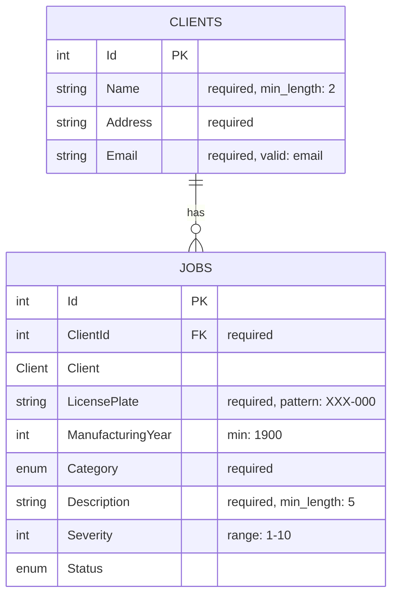

# CarMechanicWorkshop

## 📖 Table of Contents
- [Description](#-description)
- [Installation](#-installation)
- [Database](#-database)
- [API Endpoints](#-api-endpoints)

---

## 📋 Description
This is the exam project application for the C# course at University of Debrecen in 2025 Autumn.

---

## ⚙️ Installation

```bash
# Clone repository
git clone https://github.com/lonelymous/CarMechanicWorkshop.git
cd CarMechanicWorkshop

# Install dependencies
dotnet restore

# Run the tests 
dotnet test

# Run the sub project (for Windows or Linux)
cd sub_project
dotnet run

# Run the whole project with Docker
docker-compose up -d --build
```

## 🗄️ Database



## 📚 API Endpoints
A teljes OpenAPI/Swagger dokumentáció elérhető itt:  
➡️ [Swagger UI](http://localhost:8080/swagger)
